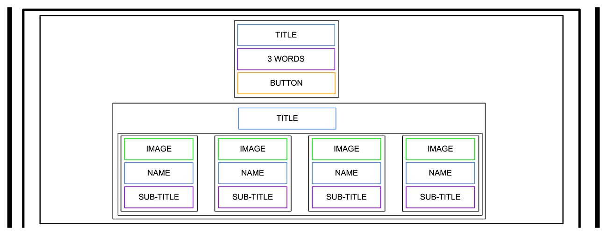

# HTML, advanced

### In this and coming projects, you will implement from scratch a webpage from a designer file.

### For this first project, you will focus on the HTML structure only - no CSS, no style - just pure HTML semantic.

- What is HTML
- How to create an HTML page from a wireframe
- What is a markup language
- What is the DOM
- What is an element / tag
- What is an attribute
- What the purpose of each HTML tag

## Tasks

0. README and objectives!

n this and coming projects, you will implement from scratch a webpage from a designer file.

For this first project, you will focus on the HTML structure only - no CSS, no style - just pure HTML semantic.

This designer file will be available on Figma - feel free to create an account to access the final result here:

Page in <a href="https://www.figma.com/file/dyYL6Ku4WG7vsdpwvlcJZC/Homepage?type=design&node-id=0-1&mode=design&t=VWRfE60vOssY5dq9-0">Figma
fig file</a>
And “Duplicate to your Drafts” to have access to all design details.

Important notes with Figma:

- if your computer doesn’t have missing fonts, you can find them here: source-sans-pro and Spin-Cycle-OT
- some values are in float - feel free to round them

### 1. Header

Let’s start by the top: the header

Here the wireframe of it:

- Create the HTML skeleton (html, head, body, etc.)
- In the body, add an header tag
- Inside this header:
  - Add a link element with an image inside
  - Add a block of 3 link elements

2. Banner

Now, the banner under the header:

Under the header, add a main element with inside a section element.

In this section element, add:

- A block with inside:
  - An heading tag (don’t forget to use the correct heading value)
  - A text element
  - A button tag
- Another block with inside:
  - Another heading tag (same, be careful about which one you are using)
  - A block containing 4 blocks - each block with inside:
    - An image
    - An heading tag
    - A text

### 3. Quote

Under the banner, we will add the quote block:

The quote section is inside the main:

- Create a new section for the quote
- Inside, add a block containing:
  - An image
  - Another block with inside:
    - A quote tag
    - An author quote
    - A text

### 4. Videos

Let’s now add the videos list:

New section with inside:

- An heading tag
- A block containing the 4 video block - each of them are composed with:
  - An image
  - An heading
  - A text
  - A block for the author:
    - A image
    - An heading
  - A block for the rating:
    - A block of images (one star = one image)
    - A text

### 5. Membership

Membership section is similar as the videos list:

After the videos list section, add a new section containing:

- An heading
- A block with inside 4 block item - each block defined with:
  - An image
  - An heading
  - A text
- A button

### 6. FAQ

The FAQ section is ending the page before the footer:

Add a section for the FAQ with inside:

- A block that contains 2 “row block”
- Each “row block” contains 2 “item block”
- Each “item block” is composed of:
  - An heading
  - A text

7. Footer

And… the footer!

After the last section, outside of the main, add a footer:

- A global block (used later for centering the footer content), inside this block:
- A “row block” with:
  - An image
  - A block with inside:
    - Images with link
- A text
